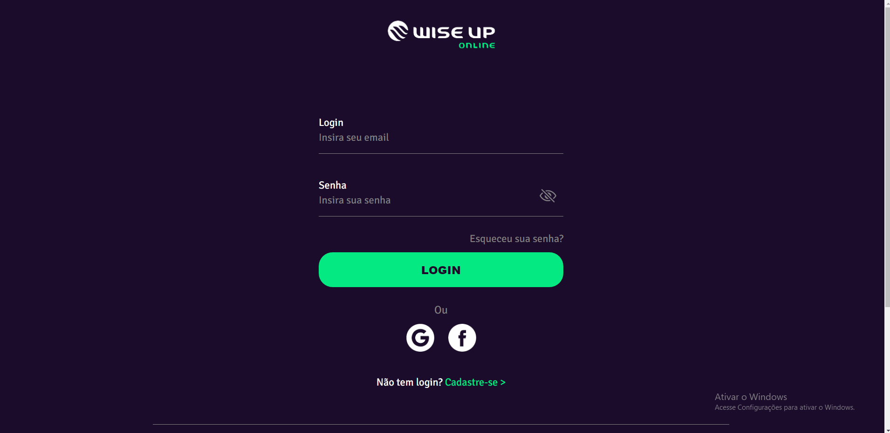
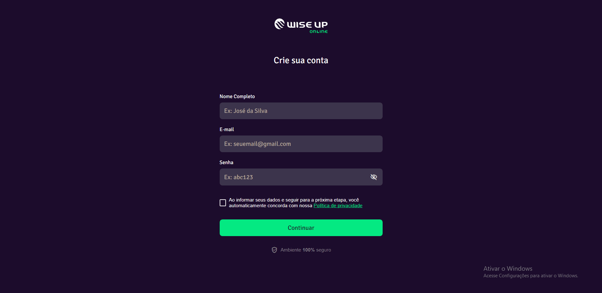

# Projeto clone página de login Wise Up Online 🪙 ✔️ 

- 💻 Salve comunidade, sabemos que existem muitos projetos clones espalhados por aí, porém acredito que este tipo de trabalho é perfeito para testar as habilidades de um dev em formação como eu.  
 

- Meu intuito neste trabalho, foi desenvolver o site, de modo que chegue ao mais próximo possível da página de login original, em termos de aparência e funcionalidades. Para isto ser possível, utilizei o FIREBASE AUTHENTICATION para: Página de criação de usuário; Página de login; Recuperação de senha e Login com Google e Facebook.   

## Features do projeto:

- Página de criação de usuário 

- Página de login 

- Recuperação de senha 

- Login com Google e Facebook 

<h1 align="center">
    
</h1>

 

<h1 align="center">
    
</h1>

 

## 🛠 &nbsp;Tecnologias utilizadas:

&nbsp;
&nbsp;
&nbsp;
&nbsp;

  

## 👨🏽‍🦲 &nbsp;Autor do projeto: Vinícius Luz; Meu linkedin:

